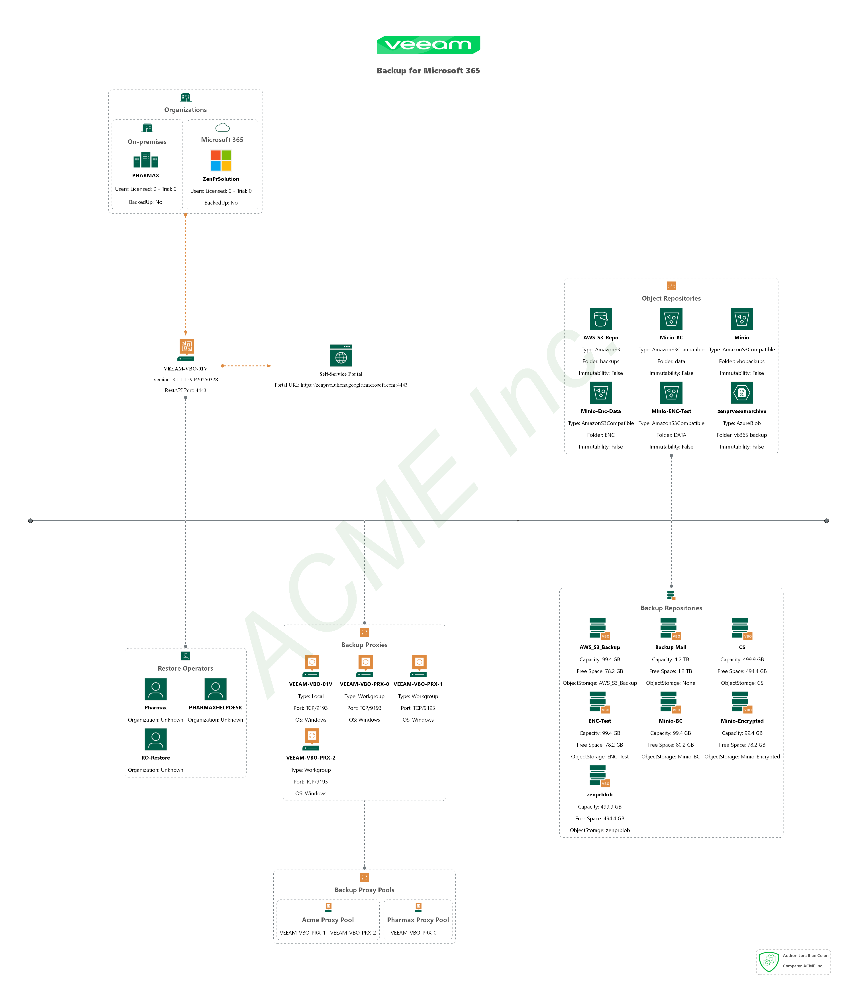

<!-- ********** DO NOT EDIT THESE LINKS ********** -->
<p align="center">
    <a href="https://www.asbuiltreport.com/" alt="AsBuiltReport"></a>
    </a>
</p>
<p align="center">
    <a href="https://www.powershellgallery.com/packages/AsBuiltReport.Veeam.VB365/" alt="PowerShell Gallery Version">
        </a>
    <a href="https://www.powershellgallery.com/packages/AsBuiltReport.Veeam.VB365/" alt="PS Gallery Downloads">
        </a>
    <a href="https://www.powershellgallery.com/packages/AsBuiltReport.Veeam.VB365/" alt="PS Platform">
        </a>
</p>
<p align="center">
    <a href="https://github.com/AsBuiltReport/AsBuiltReport.Veeam.VB365/graphs/commit-activity" alt="GitHub Last Commit">
        </a>
    <a href="https://raw.githubusercontent.com/AsBuiltReport/AsBuiltReport.Veeam.VB365/master/LICENSE" alt="GitHub License">
        </a>
    <a href="https://github.com/AsBuiltReport/AsBuiltReport.Veeam.VB365/graphs/contributors" alt="GitHub Contributors">
        </a>
</p>
<p align="center">
    <a href="https://twitter.com/AsBuiltReport" alt="Twitter">
        </a>
</p>
<!-- ********** DO NOT EDIT THESE LINKS ********** -->

> [!WARNING]
> I was recently contacted regarding the status of this project. Maintaining this report and the associated tools requires significant time and resources. If you would like to help keep this project active, please consider supporting its development by donating through Ko-fi.

<p align="center">
    <a href='https://ko-fi.com/F1F8DEV80' target='_blank'></a>
</p>

#### This project is community maintained and has no sponsorship from Veeam, its employees, or any of its affiliates.

# Veeam VB365 As Built Report

Veeam VB365 As Built Report is a PowerShell module that works in conjunction with [AsBuiltReport.Core](https://github.com/AsBuiltReport/AsBuiltReport.Core).

[AsBuiltReport](https://github.com/AsBuiltReport/AsBuiltReport) is an open-source community project that utilizes PowerShell to produce as-built documentation in multiple document formats for various vendors and technologies.

Please refer to the AsBuiltReport [website](https://www.asbuiltreport.com) for more detailed information about this project.

# :books: Sample Reports

## Sample Report - Veeam Style with EnableHealthCheck

Sample Veeam VB365 As Built report HTML file: [Sample Veeam VB365 As Built Report.html](https://htmlpreview.github.io/?https://raw.githubusercontent.com/AsBuiltReport/AsBuiltReport.Veeam.VB365/dev/Samples/Sample%20Veeam%20VB365%20As%20Built%20Report.html)

## Sample Diagram

Sample Veeam VB365 As Built report diagram file: [Sample Veeam VB365 As Built Report Diagram](https://github.com/AsBuiltReport/AsBuiltReport.Veeam.VB365/raw/dev/Samples/AsBuiltReport.Veeam.VB365.png)



# :beginner: Getting Started

Below are the instructions on how to install, configure, and generate a Veeam VB365 As Built report.

## :floppy_disk: Supported Versions

The Veeam VB365 As Built Report supports the following Veeam Backup for Microsoft 365 version:

- Veeam Backup for Microsoft 365 v6+

### PowerShell

This report is compatible with the following PowerShell versions:

| Windows PowerShell 5.1 | PowerShell 7 |
| :--------------------: | :----------: |
|   :white_check_mark:   |     :x:      |

## :wrench: System Requirements

PowerShell 5.1 and the following PowerShell modules are required for generating a Veeam VB365 As Built Report:

- [Veeam.Archiver.PowerShell Module](https://helpcenter.veeam.com/docs/vbo365/powershell/getting_started.html?ver=70)
- [PScriboCharts Module](https://github.com/iainbrighton/PScriboCharts)
- [PSGraph Module](https://github.com/KevinMarquette/PSGraph)
- [Diagrammer.Core Module](https://github.com/rebelinux/Diagrammer.Core)
- [AsBuiltReport.Veeam.VB365 Module](https://www.powershellgallery.com/packages/AsBuiltReport.Veeam.VB365/)

### :closed_lock_with_key: Required Privileges

Only users with Local Administrator group permissions can generate a Veeam VB365 As Built Report.

## :package: Module Installation

### PowerShell

```powershell
Install-Module AsBuiltReport.Veeam.VB365
```

### GitHub

If you are unable to use the PowerShell Gallery, you can still install the module manually. Ensure you repeat the following steps for the [system requirements](https://github.com/AsBuiltReport/AsBuiltReport.Veeam.VB365#wrench-system-requirements) also.

1. Download the code package / [latest release](https://github.com/AsBuiltReport/AsBuiltReport.Veeam.VB365/releases/latest) zip from GitHub.
2. Extract the zip file.
3. Copy the folder `AsBuiltReport.Veeam.VB365` to a path that is set in `$env:PSModulePath`.
4. Open a PowerShell terminal window and unblock the downloaded files with:
    ```powershell
    $path = (Get-Module -Name AsBuiltReport.Veeam.VB365 -ListAvailable).ModuleBase; Unblock-File -Path $path\*.psd1; Unblock-File -Path $path\Src\Public\*.ps1; Unblock-File -Path $path\Src\Private\*.ps1
    ```
5. Close and reopen the PowerShell terminal window.

_Note: You are not limited to installing the module to those example paths; you can add a new entry to the environment variable PSModulePath if you want to use another path._

## :pencil2: Configuration

The Veeam VB365 As Built Report utilizes a JSON file to allow configuration of report information, options, detail, and health checks.

A Veeam VB365 report configuration file can be generated by executing the following command:

```powershell
New-AsBuiltReportConfig -Report Veeam.VB365 -FolderPath <User specified folder> -Filename <Optional>
```

Executing this command will copy the default Veeam VB365 report JSON configuration to a user-specified folder.

All report settings can then be configured via the JSON file.

The following provides information on how to configure each schema within the report's JSON file.

<!-- ********** DO NOT CHANGE THE REPORT SCHEMA SETTINGS ********** -->

### Report

The **Report** schema provides configuration of the Veeam VB365 report information.

| Sub-Schema          | Setting      | Default                     | Description                                                  |
| ------------------- | ------------ | --------------------------- | ------------------------------------------------------------ |
| Name                | User defined | Veeam VB365 As Built Report | The name of the As Built Report                              |
| Version             | User defined | 1.0                         | The report version                                           |
| Status              | User defined | Released                    | The report release status                                    |
| ShowCoverPageImage  | true / false | true                        | Toggle to enable/disable the display of the cover page image |
| ShowTableOfContents | true / false | true                        | Toggle to enable/disable table of contents                   |
| ShowHeaderFooter    | true / false | true                        | Toggle to enable/disable document headers & footers          |
| ShowTableCaptions   | true / false | true                        | Toggle to enable/disable table captions/numbering            |

### Options

The **Options** schema allows certain options within the report to be toggled on or off.

| Sub-Schema             | Setting             | Default | Description                                                                                  |
| ---------------------- | ------------------- | ------- | -------------------------------------------------------------------------------------------- |
| BackupServerPort       | TCP Port            | 9191    | Specifies the custom port for the backup service.                                            |
| ReportStyle            | Veeam/AsBuiltReport | Veeam   | Sets the report style template.                                                              |
| EnableDiagrams         | true/false          | true    | Enables or disables the creation of infrastructure diagrams.                                 |
| EnableDiagramsDebug    | true/false          | false   | Enables or disables the diagram debug option.                                                |
| DiagramWaterMark       | string              | empty   | Sets the watermark for the diagram.                                                          |
| DiagramTheme           | string              | White   | Sets the diagram theme. Options are Black, White, or Neon.                                   |
| ExportDiagrams         | true/false          | false   | Enables or disables the option to export diagrams.                                           |
| ExportDiagramsFormat   | string array        | png     | Sets the format for exporting the infrastructure diagram. Options are dot, png, pdf, or svg. |
| EnableDiagramSignature | true/false          | false   | Enables or disables the diagram signature in the bottom right corner.                        |
| SignatureAuthorName    | string              | empty   | Sets the author name for the diagram signature.                                              |
| SignatureCompanyName   | string              | empty   | Sets the company name for the diagram signature.                                             |
| RoundUnits             | int                 | 1       | Sets the rounding units for data values.                                                     |

### InfoLevel

The **InfoLevel** schema allows configuration of each section of the report at a granular level. The following sections can be set.

There are 3 levels (0-2) of detail granularity for each section as follows:

| Setting | InfoLevel         | Description                                                          |
| :-----: | ----------------- | -------------------------------------------------------------------- |
|    0    | Disabled          | Does not collect or display any information                          |
|    1    | Enabled / Summary | Provides summarized information for a collection of objects          |
|    2    | Adv Summary       | Provides condensed, detailed information for a collection of objects |

The table below outlines the default and maximum **InfoLevel** settings for each Infrastructure section.

| Sub-Schema      | Default Setting | Maximum Setting |
| --------------- | :-------------: | :-------------: |
| ServerConfig    |        1        |        1        |
| License         |        1        |        2        |
| Proxy           |        1        |        2        |
| Repository      |        1        |        2        |
| Organization    |        1        |        2        |
| EncryptionKey   |        1        |        2        |
| CloudCredential |        1        |        2        |

The table below outlines the default and maximum **InfoLevel** settings for each Jobs section.

| Sub-Schema    | Default Setting | Maximum Setting |
| ------------- | :-------------: | :-------------: |
| BackupJob     |        1        |        2        |
| BackupCopyJob |        1        |        2        |

The table below outlines the default and maximum **InfoLevel** settings for each Restore Session section.

| Sub-Schema     | Default Setting | Maximum Setting |
| -------------- | :-------------: | :-------------: |
| RestoreSession |        1        |        2        |
| RestorePoint   |        1        |        1        |

### Healthcheck

The **Healthcheck** schema is used to toggle health checks on or off.

## :computer: Examples

There are a few examples listed below on running the AsBuiltReport script against a Veeam Backup Server. Refer to the `README.md` file in the main AsBuiltReport project repository for more examples.

```powershell
# Generate a Veeam VB365 As Built Report for Backup Server 'veeam-vbr365.pharmax.local' using specified credentials. Export report to HTML & DOCX formats. Use default report style. Append timestamp to report filename. Save reports to 'C:\Users\Jon\Documents'
PS C:\> New-AsBuiltReport -Report Veeam.VB365 -Target veeam-vbr365.pharmax.local -Username 'Domain\veeam_admin' -Password 'P@ssw0rd' -Format Html,Word -OutputFolderPath 'C:\Users\Jon\Documents' -Timestamp

# Generate a Veeam VB365 As Built Report for Backup Server veeam-vbr365.pharmax.local using specified credentials and report configuration file. Export report to Text, HTML & DOCX formats. Use default report style. Save reports to 'C:\Users\Jon\Documents'. Display verbose messages to the console.
PS C:\> New-AsBuiltReport -Report Veeam.VB365 -Target veeam-vbr365.pharmax.local -Username 'Domain\veeam_admin' -Password 'P@ssw0rd' -Format Html,Word -OutputFolderPath 'C:\Users\Jon\Documents' -ReportConfigFilePath 'C:\Users\Jon\AsBuiltReport\AsBuiltReport.Veeam.VB365.json' -Verbose

# Generate a Veeam VB365 As Built Report for Backup Server veeam-vbr365.pharmax.local using stored credentials. Export report to HTML & Text formats. Use default report style. Highlight environment issues within the report. Save reports to 'C:\Users\Jon\Documents'.
PS C:\> $Creds = Get-Credential
PS C:\> New-AsBuiltReport -Report Veeam.VB365 -Target veeam-vbr365.pharmax.local -Credential $Creds -Format Html,Text -OutputFolderPath 'C:\Users\Jon\Documents' -EnableHealthCheck

# Generate a Veeam VB365 As Built Report for Backup Server veeam-vbr365.pharmax.local using stored credentials. Export report to HTML & DOCX formats. Use default report style. Reports are saved to the user profile folder by default. Attach and send reports via e-mail.
PS C:\> New-AsBuiltReport -Report Veeam.VB365 -Target veeam-vbr365.pharmax.local -Username 'Domain\veeam_admin' -Password 'P@ssw0rd' -Format Html,Word -OutputFolderPath 'C:\Users\Jon\Documents' -SendEmail
```

## :x: Known Issues

- Error when generating a report in Word format.
  - Error Message: New-AsBuiltReport : The variable '$Images' cannot be retrieved because it has not been set
  - Fix: Disable the generation of the cover page image. Set ShowCoverPageImage to false
